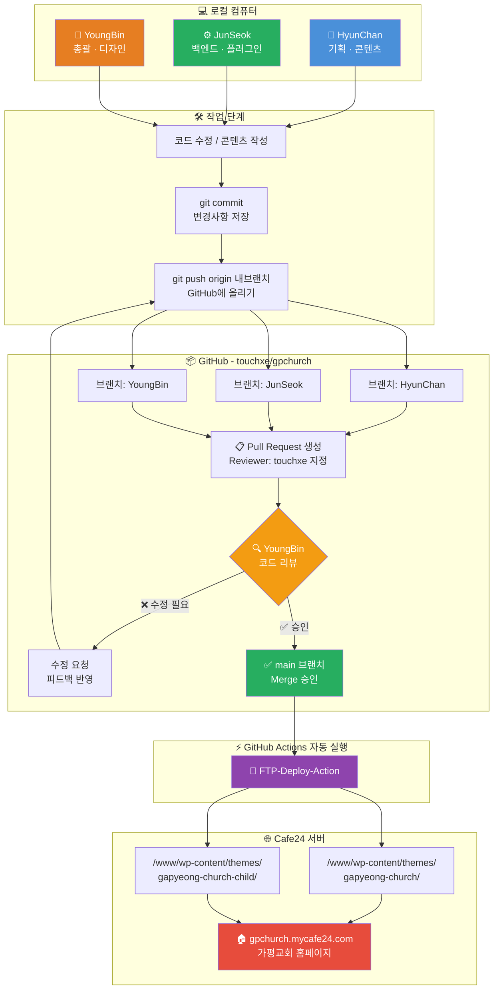

# 📖 가평교회 홈페이지 팀 협업 가이드

> 이 문서는 가평교회 홈페이지 개발에 참여하는 모든 팀원을 위한 협업 가이드입니다.  
> **처음 참여하는 분은 반드시 처음부터 끝까지 읽어주세요!**

---

## 목차

1. [전체 개발 흐름](#1-전체-개발-흐름)
2. [역할 분담](#2-역할-분담)
3. [개발 환경 설정 (최초 1회)](#3-개발-환경-설정-최초-1회)
4. [매일 작업 순서](#4-매일-작업-순서)
5. [Pull Request (PR) 작성법](#5-pull-request-pr-작성법)
6. [관리자(YoungBin) 작업 순서](#6-관리자youngbin-작업-순서)
7. [자동 배포 확인](#7-자동-배포-확인)
8. [자주 쓰는 Git 명령어](#8-자주-쓰는-git-명령어)
9. [주의사항 및 규칙](#9-주의사항-및-규칙)
10. [문제 발생 시 대처법](#10-문제-발생-시-대처법)

---

## 1. 전체 개발 흐름

### 🗺️ 협업 플로우차트



### 🔄 단계별 설명

| 단계 | 담당 | 설명 |
|------|------|------|
| 1️⃣ 작업 | HyunChan · JunSeok · YoungBin | 각자 역할에 맞게 로컬에서 작업 |
| 2️⃣ Commit & Push | 팀원 | 내 브랜치에 저장 후 GitHub에 올리기 |
| 3️⃣ PR 생성 | 팀원 | Reviewer에 `touchxe` 지정하여 검토 요청 |
| 4️⃣ 코드 리뷰 | YoungBin | 변경 내용 검토 — 수정 요청 또는 승인 |
| 5️⃣ Merge | YoungBin | 문제 없으면 main 브랜치에 병합 |
| 6️⃣ 자동 배포 | GitHub Actions | Merge 즉시 Cafe24 서버로 FTP 자동 배포 |
| 7️⃣ 확인 | 모두 | 사이트에서 반영 여부 확인 |

---


## 2. 역할 분담

| 이름 | 역할 | 담당 업무 | 브랜치 |
|------|------|-----------|--------|
| YoungBin | 총괄 · 디자인 | 프로젝트 전체 총괄, UI/UX 디자인, 코드 리뷰, 배포 관리 | `YoungBin` |
| HyunChan | 기획 · 콘텐츠 | 사이트 기획, 콘텐츠 작성 및 관리, 페이지 구성 | `HyunChan` |
| JunSeok | 백엔드 · 플러그인 · 프로그래밍 | 백엔드 개발, WordPress 플러그인 설치/설정, 기능 구현 | `JunSeok` |

---

### 🎨 YoungBin (총괄 · 디자인)

**담당 업무:**
- **프로젝트 총괄** — 전체 방향 설정 및 일정 관리
- **UI/UX 디자인** — 사이트 시각 디자인, 레이아웃 설계
- **코드 리뷰** — 팀원들이 올린 코드를 검토하고 품질 관리
- **Merge 최종 결정** — `main` 브랜치 병합 여부 최종 판단
- **배포 모니터링** — GitHub Actions 배포 성공/실패 확인
- **저장소 관리** — 브랜치 관리, GitHub Secrets 관리

**권한:**
- `main` 브랜치 직접 Push 가능 (긴급 수정 시)
- PR Merge 권한
- GitHub Secrets(FTP 비밀번호 등) 접근 권한

---

### 📋 HyunChan (기획 · 콘텐츠)

**담당 업무:**
- **사이트 기획** — 페이지 구성, 메뉴 구조, 사용자 흐름 설계
- **콘텐츠 관리** — 교회 소개, 예배 안내, 소식 등 텍스트/이미지 콘텐츠
- **페이지 레이아웃** — 콘텐츠 배치 및 구성 수정
- **WordPress 관리자** — 포스트, 페이지, 미디어 관리

**주요 작업 파일:**
```
wp-content/themes/gapyeong-church-child/
├── style.css          ← 콘텐츠 영역 스타일
wp-content/themes/gapyeong-church/
├── template-parts/    ← 페이지 구성 요소
└── page-*.php         ← 개별 페이지 템플릿
```

**규칙:**
- `main` 브랜치에 직접 Push ❌
- 작업 전 항상 최신 코드 Pull (`git pull origin main`)
- PR 생성 시 Reviewer에 반드시 `touchxe` 지정

---

### ⚙️ JunSeok (백엔드 · 플러그인 · 프로그래밍)

**담당 업무:**
- **백엔드 개발** — PHP 기반 WordPress 기능 개발
- **플러그인 관리** — 플러그인 설치, 설정, 커스터마이징
- **기능 구현** — 폼, API 연동, 게시판 등 인터랙티브 기능
- **성능 최적화** — 속도 개선, 캐시 설정

**주요 작업 파일:**
```
wp-content/themes/gapyeong-church-child/
├── functions.php      ← 기능 추가/수정
wp-content/plugins/    ← 플러그인 디렉토리
```

**규칙:**
- `main` 브랜치에 직접 Push ❌
- 플러그인 추가/삭제 시 YoungBin과 사전 협의
- PR 생성 시 Reviewer에 반드시 `touchxe` 지정

---

## 3. 개발 환경 설정 (최초 1회)

### 필요 프로그램 설치

| 프로그램 | 용도 | 다운로드 |
|----------|------|----------|
| Git | 버전 관리 도구 | [git-scm.com](https://git-scm.com/downloads) |
| GitHub Desktop | Git GUI 도구 (선택) | [desktop.github.com](https://desktop.github.com) |
| VS Code | 코드 편집기 | [code.visualstudio.com](https://code.visualstudio.com) |

---

### Step 1: 저장소 클론 (내 컴퓨터로 가져오기)

#### GitHub Desktop 사용 시
1. GitHub Desktop 실행
2. `File` → `Clone Repository` 클릭
3. `URL` 탭 선택
4. URL 입력:
   ```
   https://github.com/touchxe/gpchurch
   ```
5. 저장 위치 선택 후 `Clone` 클릭

#### 터미널 사용 시
```bash
git clone https://github.com/touchxe/gpchurch.git
cd gpchurch
```

---

### Step 2: 내 브랜치 만들기

> ⚠️ 브랜치 이름은 **자기 이름(영문)**으로 통일합니다.  
> 예: `HyunChan`, `JunSeok`

#### GitHub Desktop 사용 시
1. 상단 `Current Branch` 드롭다운 클릭
2. `New Branch` 클릭
3. 이름 입력 (예: `HyunChan`)
4. `Create Branch` 클릭

#### 터미널 사용 시
```bash
# 브랜치 생성 + 이동 동시에
git checkout -b HyunChan
```

---

### Step 3: GitHub 계정 연동 확인

터미널에서 아래 명령어로 연동 상태 확인:

```bash
git config user.name   # 이름이 뜨면 OK
git config user.email  # 이메일이 뜨면 OK
```

안 뜨면 아래처럼 설정:

```bash
git config --global user.name "HyunChan"
git config --global user.email "your-email@example.com"
```

---

## 4. 매일 작업 순서

### ✅ STEP 1: 작업 시작 전 — 최신 코드 받기

> 다른 팀원이 작업한 내용을 먼저 내려받아 충돌을 예방합니다.

#### GitHub Desktop 사용 시
1. 상단 `Fetch origin` 클릭
2. `Pull origin` 버튼이 생기면 클릭

#### 터미널 사용 시
```bash
# main 브랜치의 최신 내용을 내 브랜치에 반영
git fetch origin
git checkout HyunChan        # 내 브랜치로 이동
git merge origin/main        # main의 최신 내용 합치기
```

---

### ✅ STEP 2: 코드 수정

VS Code에서 파일을 열고 수정합니다.

**주요 작업 경로:**

```
wp-content/themes/
├── gapyeong-church/          ← 메인 테마 (구조 변경 시)
│   ├── assets/
│   │   ├── css/              ← 스타일시트
│   │   └── js/               ← 자바스크립트
│   ├── template-parts/       ← 공통 컴포넌트
│   └── page-*.php            ← 페이지 템플릿
│
└── gapyeong-church-child/    ← 자식 테마 (일반 수정은 여기서!)
    ├── functions.php         ← 기능 추가
    └── style.css             ← 스타일 덮어쓰기
```

> 💡 **Tip:** 가능하면 자식 테마(`gapyeong-church-child`)에서 작업하세요.  
> 메인 테마는 업데이트 시 변경사항이 사라질 수 있습니다.

---

### ✅ STEP 3: 변경사항 저장 (Commit)

#### GitHub Desktop 사용 시
1. 좌측 `Changes` 탭에서 변경 파일 목록 확인
2. 저장할 파일 체크박스 선택 (기본: 전체 선택)
3. 좌측 하단 `Summary` 칸에 작업 내용 한 줄 요약 입력
4. `Commit to HyunChan` 버튼 클릭

#### 터미널 사용 시
```bash
git add .                           # 모든 변경사항 선택
git commit -m "홈페이지 배너 이미지 변경"  # 커밋 메시지 (한국어 OK)
```

**좋은 커밋 메시지 예시:**
```
✅ 좋은 예시
- "메인 메뉴 폰트 크기 조정"
- "모바일 헤더 레이아웃 수정"
- "예배 안내 페이지 내용 업데이트"

❌ 나쁜 예시
- "수정"
- "업데이트"
- "asdf"
```

---

### ✅ STEP 4: GitHub에 올리기 (Push)

#### GitHub Desktop 사용 시
- 상단 `Push origin` 버튼 클릭

#### 터미널 사용 시
```bash
git push origin HyunChan
```

---

### ✅ STEP 5: Pull Request 생성

[다음 섹션 참조 ↓](#5-pull-request-pr-작성법)

---

## 5. Pull Request (PR) 작성법

PR은 "내 작업을 메인 코드에 합쳐주세요!"라고 YoungBin에게 요청하는 과정입니다.

### Step 1: GitHub 접속
1. 브라우저에서 https://github.com/touchxe/gpchurch 접속
2. GitHub 로그인

### Step 2: PR 생성 버튼 찾기
- Push 직후: 페이지 상단에 노란 배너 `Compare & pull request` 버튼 클릭
- 없을 경우: `Pull requests` 탭 → `New pull request` 클릭

### Step 3: 브랜치 설정 확인
```
base: main  ←  compare: HyunChan
```
: main ← HyunChan 방향인지 확인 (내 작업이 main으로 들어가는 방향)

### Step 4: PR 내용 작성

**제목 (Title):**
```
[분류] 변경 내용 요약

예: [디자인] 메인 페이지 배너 이미지 교체        ← YoungBin
예: [콘텐츠] 예배 안내 페이지 텍스트 업데이트    ← HyunChan
예: [기능] 문의 폼 이메일 발송 기능 추가         ← JunSeok
예: [플러그인] 캘린더 플러그인 설정 수정          ← JunSeok
```

**설명 (Description) — 이 내용을 포함해주세요:**
```markdown
## 변경 사항
- 무엇을 바꿨나요?

## 변경 이유
- 왜 바꿨나요?

## 확인 방법
- 어떻게 테스트하면 되나요?

## 기타
- 특별히 검토해야 할 부분이 있나요?
```

### Step 5: Reviewer 지정
- 우측 `Reviewers` 클릭
- `touchxe` 검색 후 선택 ✅

### Step 6: PR 생성
- `Create pull request` 버튼 클릭
- → YoungBin에게 자동으로 알림 전송! 📩

---

## 6. 관리자(YoungBin) 작업 순서

### 📬 PR 알림 받기
- GitHub에서 이메일 알림 수신
- GitHub 웹사이트 상단 벨(🔔) 아이콘에서 확인

### 🔍 코드 리뷰
1. PR 클릭 → `Files changed` 탭 클릭
2. 변경된 파일과 내용 확인
3. 문제 없으면: `Review changes` → `Approve` → `Submit review`
4. 수정 필요하면: 해당 코드 라인에 댓글 → `Request changes`

### ✅ Merge (병합 승인)
1. `Conversation` 탭으로 이동
2. 초록색 `Merge pull request` 버튼 클릭
3. `Confirm merge` 클릭
4. → GitHub Actions 자동 배포 시작! 🚀

### 📊 배포 확인
1. `Actions` 탭 클릭
2. 가장 최근 워크플로 클릭
3. 진행 상황 확인:
   - 🟡 노란색 = 배포 진행 중 (1~2분 소요)
   - ✅ 초록색 = 배포 성공
   - ❌ 빨간색 = 배포 실패 (로그 확인 필요)

---

## 7. 자동 배포 확인

### 배포 흐름
```
Merge 완료
    ↓ (자동 트리거)
GitHub Actions 실행
    ↓ (약 1~2분)
FTP로 Cafe24 서버에 파일 전송
    ├── /www/wp-content/themes/gapyeong-church/
    └── /www/wp-content/themes/gapyeong-church-child/
    ↓
gpchurch.mycafe24.com 에 반영
```

### 배포 결과 확인 링크
🔗 https://github.com/touchxe/gpchurch/actions

### 배포 실패 시
1. 실패한 워크플로 클릭
2. 빨간 X 표시 단계 클릭
3. 로그 확인 후 YoungBin에게 전달

---

## 8. 자주 쓰는 Git 명령어

### 기본 명령어

```bash
# 현재 상태 확인
git status

# 변경된 파일 목록 보기
git diff

# 특정 파일만 커밋에 포함
git add wp-content/themes/gapyeong-church-child/style.css

# 모든 변경사항 포함
git add .

# 커밋하기
git commit -m "메시지"

# GitHub에 올리기
git push origin HyunChan

# 최신 코드 받기
git pull origin main
```

### 브랜치 관련

```bash
# 현재 브랜치 확인
git branch

# 브랜치 이동
git checkout HyunChan

# 새 브랜치 만들고 이동
git checkout -b NewBranchName

# 브랜치 목록 (원격 포함)
git branch -a
```

### 실수했을 때

```bash
# 아직 커밋 안 한 변경사항 되돌리기
git checkout -- 파일명
git restore 파일명         # 최신 Git 문법

# 마지막 커밋 메시지 수정 (Push 전에만!)
git commit --amend -m "새 메시지"

# 커밋은 했지만 Push 전 되돌리기
git reset HEAD~1
```

---

## 9. 주의사항 및 규칙

### 🚫 절대 하면 안 되는 것

| 금지 사항 | 이유 |
|-----------|------|
| `main` 브랜치에 직접 Push | 검토 없이 라이브 사이트에 즉시 반영됨 |
| `.env` 파일 커밋/Push | FTP 비밀번호, API 키 등 민감 정보 유출 |
| `*.pem` 파일 커밋/Push | SSH 개인 키 유출 |
| 다른 사람 브랜치에 무단 Push | 팀원 작업 덮어쓰기 위험 |

### ✅ 반드시 해야 하는 것

| 규칙 | 방법 |
|------|------|
| 작업 전 최신 코드 Pull | `git pull origin main` 또는 GitHub Desktop |
| 커밋 메시지 명확히 작성 | 무슨 작업인지 한눈에 알 수 있게 |
| PR 설명 충실히 작성 | YoungBin이 빠르게 검토할 수 있도록 |
| PR Reviewer에 YoungBin 지정 | 알림이 가야 검토를 해줌 |

---

## 10. 문제 발생 시 대처법

### 충돌(Conflict)이 발생했을 때

충돌은 두 사람이 같은 파일의 같은 부분을 수정했을 때 발생합니다.

```bash
# 충돌 파일 확인
git status

# 충돌 파일 열어서 수동으로 해결
# <<<<<<< HEAD     ← 내 변경사항
# (내용)
# =======
# (내용)
# >>>>>>> main     ← main의 변경사항
# 두 내용 중 올바른 것만 남기고 나머지 삭제

# 해결 후
git add .
git commit -m "충돌 해결"
```

> 💡 복잡한 충돌은 혼자 해결하려 하지 말고 YoungBin에게 연락하세요!

---

### 잘못 Push 했을 때

이미 GitHub에 올라간 커밋은 함부로 삭제하면 안 됩니다.  
**YoungBin에게 즉시 연락**하세요.

---

### 배포가 실패했을 때

1. [Actions 탭](https://github.com/touchxe/gpchurch/actions) 확인
2. 실패 로그를 캡처해서 YoungBin에게 전달
3. YoungBin이 수정 후 재배포

---

## 📞 연락

문제가 생기면 가장 빠른 방법으로 YoungBin에게 연락하세요!

---

*최초 작성: 2026년 4월 12일*  
*최종 수정: 2026년 4월 12일*  
*관리: YoungBin ([@touchxe](https://github.com/touchxe))*
